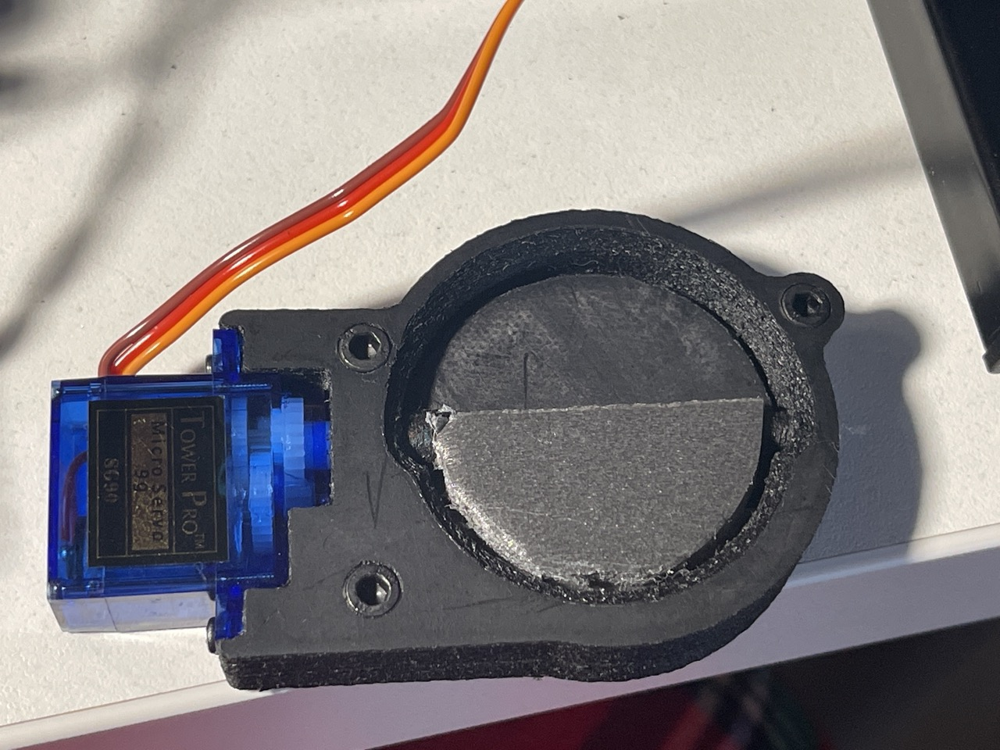

# Luftklappe

(*Originalluftklappen*)

## Endgültige Version
Endgültige Version der Belüftungsklappe der Kammer. Dieses Modell ist für eine Wandstärke des Trockners von 30 mm ausgelegt. Durch Änderung der Dicke des Diffusors kann es jedoch für jeden Gehäuse angepasst werden. Die Montage ist vereinfacht - es ist nur ein durchgehendes Sechskantloch erforderlich. Der Diffusor wird mit minimaler Füllung gedruckt, was eine gute Wärmeisolierung bietet.

!!! info "CAD-Dateien [von @gungrel](https://t.me/gungrel)"

    [Luftklappe](../../../CAD/common/air-damper-air-damper-v0/damper_final.stp)

## Alte Version

gedacht für regelmäßige Belüftung der Kammer

Ein Servoantrieb [SG90 9g](https://aliexpress.ru/item/32962841728.html?sku_id=66666348213&spm=.search_results.16.6c0b4aa6tK2QUa) muss gekauft werden

!!! info "CAD-Dateien [von @gungrel](https://t.me/gungrel)"

    [Luftklappe](../../../CAD/common/air-damper-air-damper-v0/air_damper.stp)

!!! note "Druckdateien"

    [air_damper_back.stl](../../../CAD/common/air-damper-air-damper-v0/STL/air_damper_back.stl)

    [air_damper_diffuser.stl](../../../CAD/common/air-damper-air-damper-v0/STL/air_damper_diffuser.stl)

    [air_damper_flap.stl](../../../CAD/common/air-damper-air-damper-v0/STL/air_damper_flap.stl)

    [air_damper_front.stl](../../../CAD/common/air-damper-air-damper-v0/STL/air_damper_front.stl)
