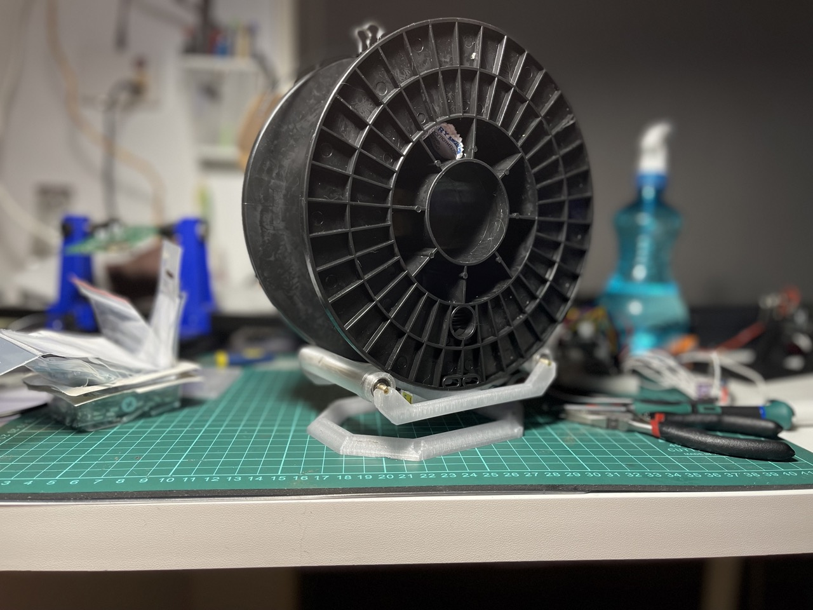
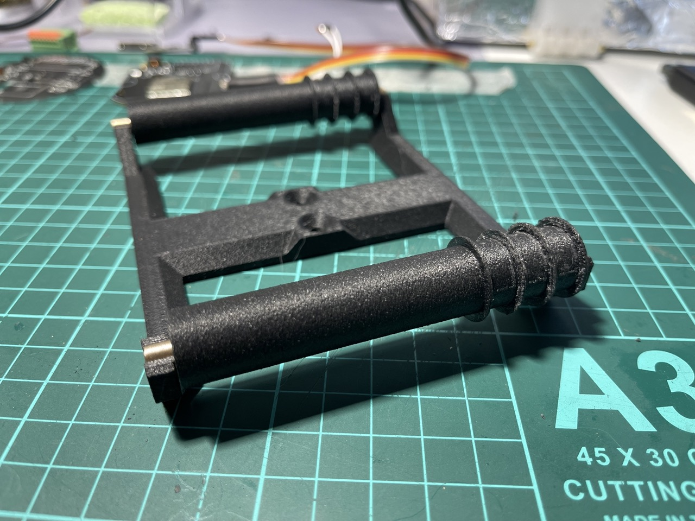
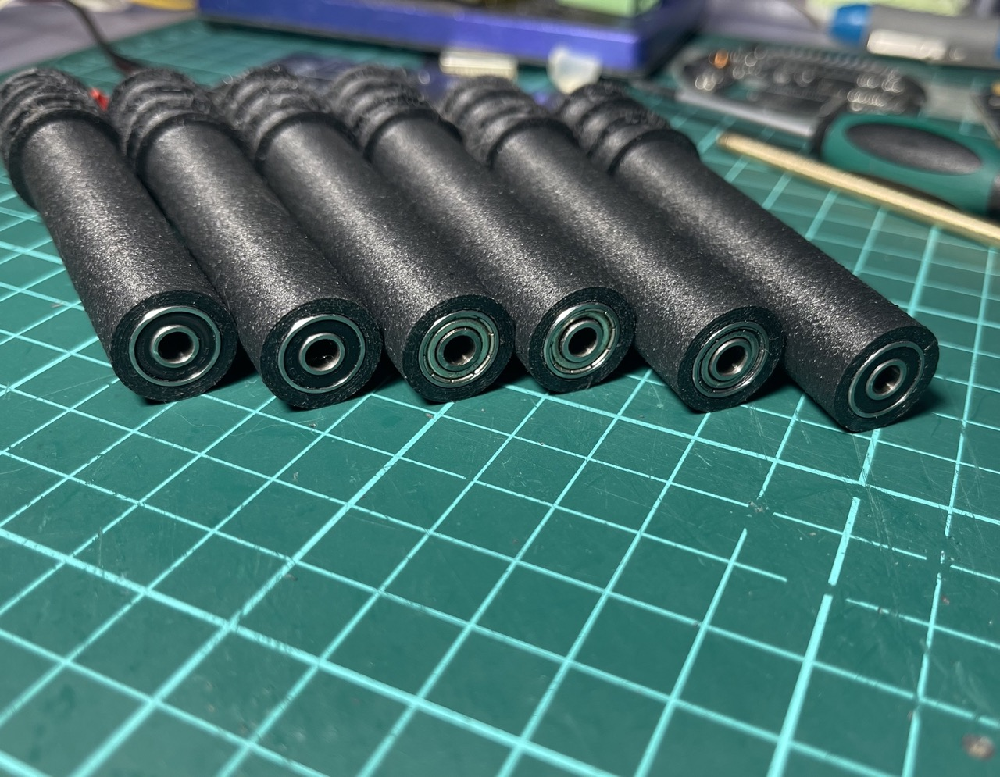
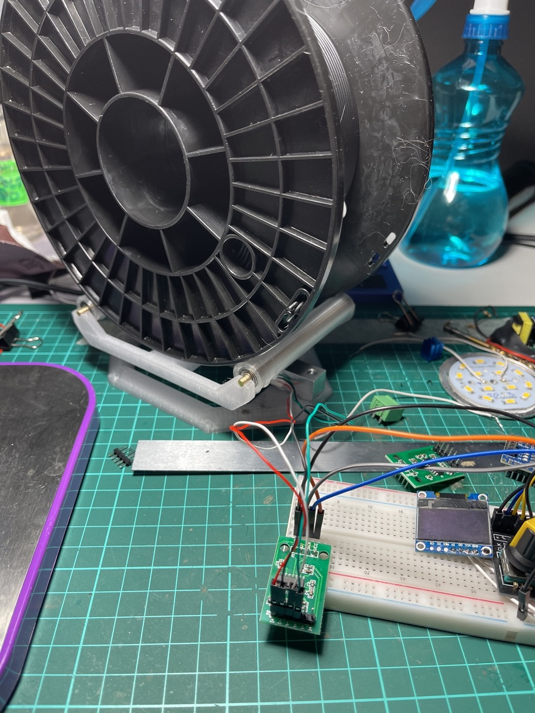
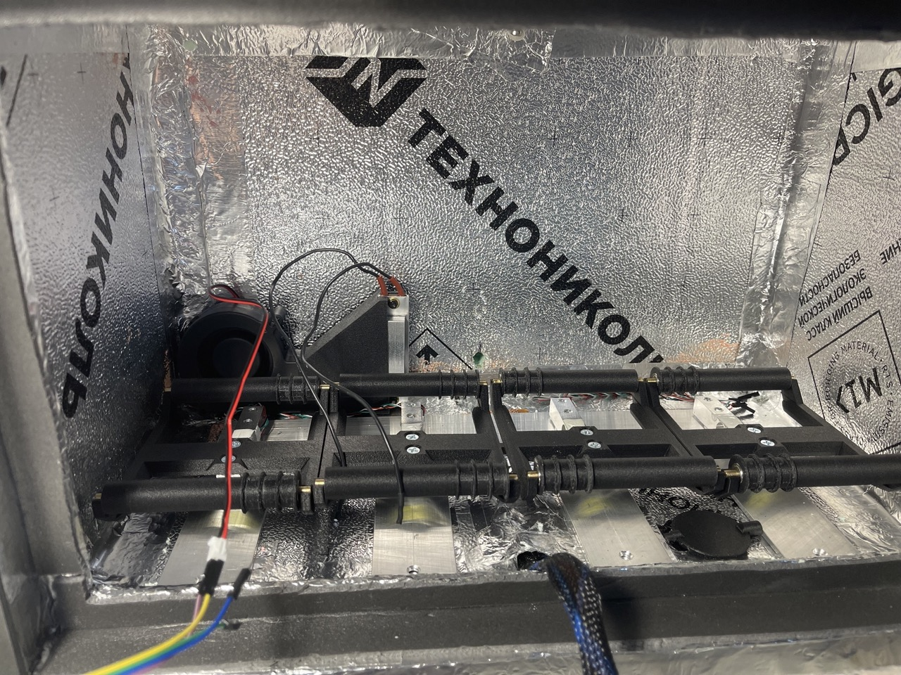
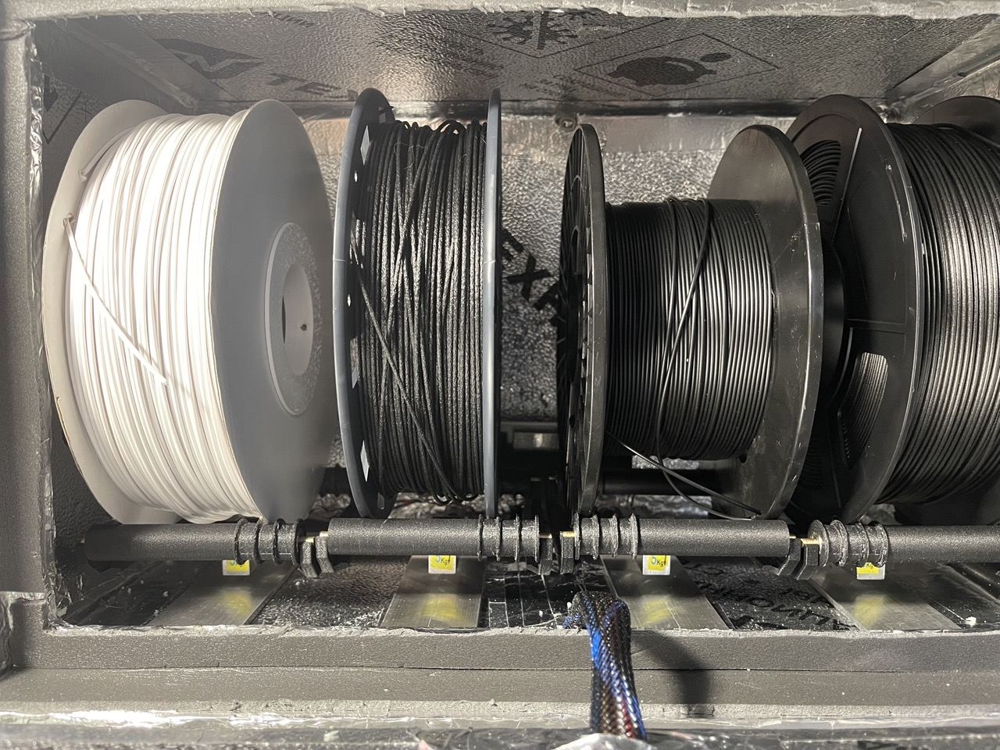
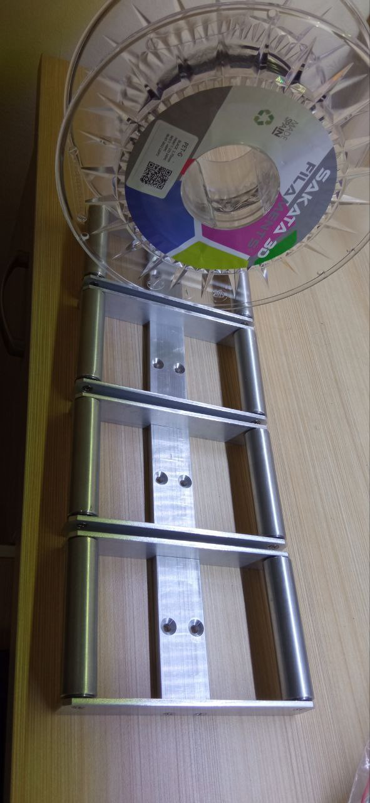
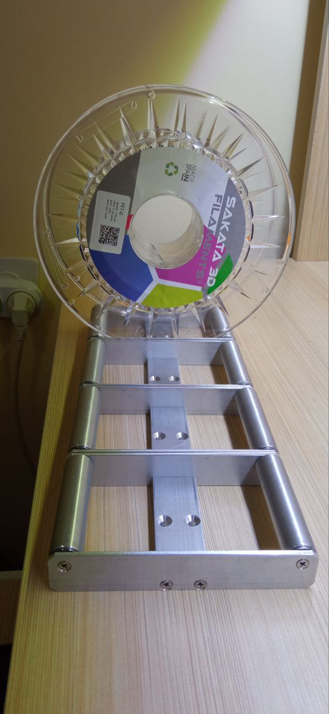

# Spulenmodul

Dient zur Lagerung von Spulen und zur Verfolgung des Filamentbestands. Der Bestand wird auf dem Display angezeigt und kann über einen Signalausgang gemeldet werden.

## Gedruckte Variante
Der obere Teil des Moduls ist eine praktische Alternative zu vorhandenen Spulenhaltern.
Es werden 694 Kugellager oder ähnliche Kugellager (11x4x4) und eine Bronzestange d4 aus dem Eisenwarenhandel als Achse verwendet.
Druck erfolgt aus Komposit-ABS oder einem beliebigen Kunststoff, der die maximal geplante Trocknungstemperatur + 10-15 Grad aushalten kann.

Erforderlich ist der Kauf einer [Load-Cell-Modul- und HX711-Waage](https://aliexpress.ru/item/32860114708.html?sku_id=12000024686706530&spm=a2g2w.productlist.search_results.0.33494aa6rTvrLS)

Die Modelle lassen sich leicht an vorhandene Kugellager anpassen.

!!! note "Dateien für den 3D-Druck"

    [Waage eng.stp](../../../CAD/common/scale-module/scale_narrow.stp)

    [Waage.stp](../../../CAD/common/scale-module/scale.stp)

## Metallische Varianten
Mehrere Metallvarianten wurden von Gruppenmitgliedern entwickelt.

### Von @gungrel
Spulenhalter aus Metall, gebogen für 623er Kugellager. In der Montage für Basen mit 1, 2, 3 und 4 Spulen. Als Rolle wird ein Aluminium-Rohr 12x1 verwendet.

!!! info "Modell zum Laserschneiden und Biegen [von @gungrel](https://t.me/gungrel)"

    [Spulenhalter Biegung endgültig.stp](../../../CAD/common/scale-module/spool_holder_bending_final.stp)

### Remix [von @Kekht](https://t.me/Kekht)
*für frühe Version des Halters [von @gungrel](https://t.me/gungrel)*

**Eigenschaften der Änderung:**

  Maximale Spulenbreite - 83,6 mm

  Verwendete Kugellager 686 und Aluminium-Rohr - Außendurchmesser 15 mm Innendurchmesser 13 mm

  Zur Befestigung der Kugellager werden gedruckte Ankereinsätze und M3-Schrauben verwendet

  Durchmesser des Ankerlochs 8 mm, so dass durch Änderung nur der Anker jede Kugellager und jedes Rohr verwendet werden kann (maximaler Rohrdurchmesser 23 mm)

  Anker sollten am besten aus Polyamid (reines oder Komposit) gedruckt werden. Bei Bedarf werden die Anker nach dem Ausschrauben der Ankerschrauben mühelos herausgezogen

  An den Seiten des Halters befinden sich zusätzliche Löcher, an denen Stützen-Halter für nicht standardisierte Spulen (z.B. Pappspulen) oder Proben befestigt werden können

  Ein Abstandshalter für den Lastmesser ist vorgesehen, der es ermöglicht, seine Drähte zusätzlich auf dem Riemen zu befestigen

  Vorgesehene Löcher zur Befestigung der Füße (im Modell zwei Varianten) oder spezielle Befestigungsdruckplatten (auch zwei Varianten für verschiedene Schraubentypen), die es ermöglichen, Halter zu einem "Paket" zusammenzufügen.

    Schnittzeichnung für Biegen mit den folgenden Parametern:
    Biegeradius für 3 mm Stahl - 2,7
    Biegeradius für 2 mm Stahl - 1,8
    Minimale Flanschbreite - 14 mm
    Biegefaktor K - 0,44

[Video](https://www.youtube.com/embed/iAZZLo_1NXo?si=j_zRWY-Wy7RiXFXJ)

!!! info "Remix [von @Kekht](https://t.me/Kekht) für frühe Version des Halters [von @gungrel](https://t.me/gungrel)"

    [SpoolHolderWeightModule_v1_3_2.STEP](../../../CAD/common/scale-module/SpoolHolderWeightModule_v1_3_2.STEP)

    [Rollers_Holder_v1_3.DXF](../../../CAD/common/scale-module/Rollers_Holder_v1_3.DXF)

    [Base_Single_v1_2.DXF](../../../CAD/common/scale-module/Base_Single_v1_2.DXF)

### Variante von Sasha

!!! note "Modell zum Fräsen"

    [Sasha.STEP](../../../CAD/common/scale-module/Sasha.STEP)

    [entwickelt von Sasha](https://t.me/iDryer/9446)
