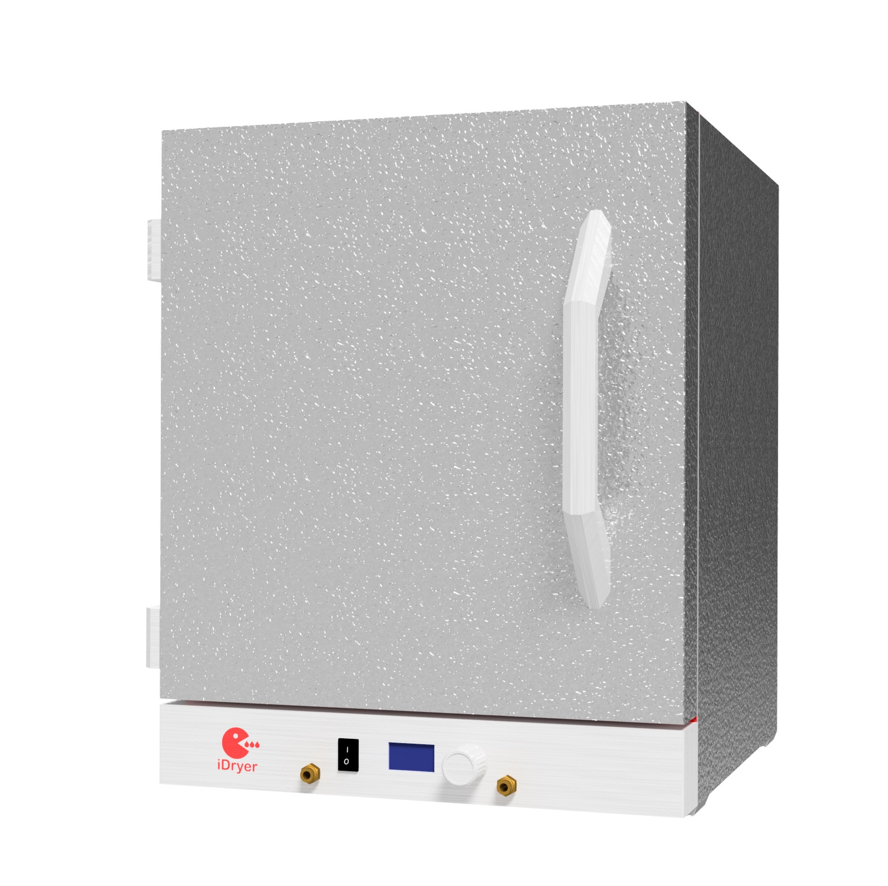
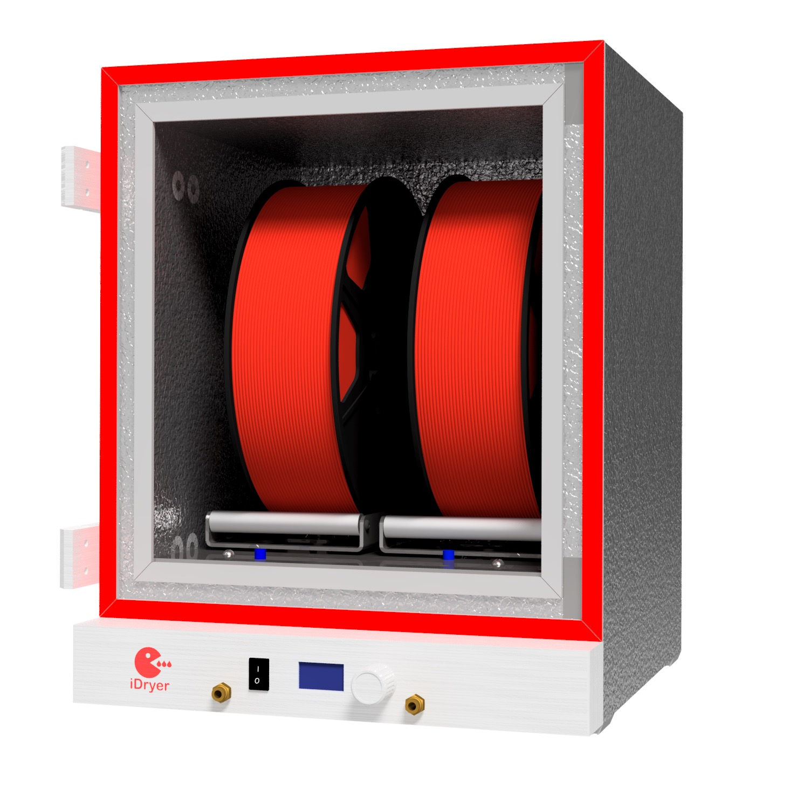
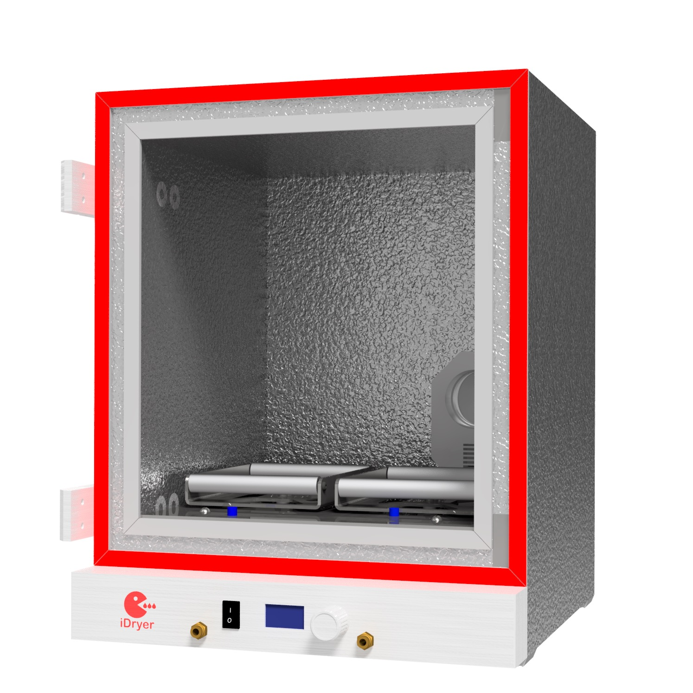

# iDryer x2 Filament-Trockner

## Eigenschaften

- Anzahl der Spulen: 2
- Trocknungstemperatur: bis 110°C
- Heizerkontrolle: ja
- Lufttemperaturkontrolle in der Kammer: ja
- Trocknungszeit: unbegrenzt
- Erzwungene Belüftung: ja
- Filament-Wiegen: ja
- Voreinstellungen: ja
- Filamenttypen: PLA, ABS, HIPS, PETG, SBS, Flex, PA6, PA12, PC, ABS, ASA, PP, POM und andere

!!! info "Vollständiges Gehäusemodell"

    [Gehäuse PIR x2](../../../CAD/v2/PIRx2.stp)

    Material der gedruckten Teile - ABS oder ABS CF

!!! note "Zuschnitt"

    [Zuschnittplan x2](../../../PDF/v2/cut_plan_x2.pdf)

!!! warning "Wichtig"

    Alle Teile im Gehäuseinneren werden aus Materialien gedruckt, die 100°C und höher vertragen.

    Der Luftkanal im Keller des Trockners muss isoliert werden. Die Wärmeisolierung des Luftkanals ist im Projekt x4 zu Informationszwecken vorgesehen und kann in gleicher Weise oder durch Abkleben des Luftkanals mit beliebigem Isoliermaterial verwendet werden. Andernfalls wird die Aufheizgeschwindigkeit verringert und der Stromverbrauch wird erheblich erhöht!
