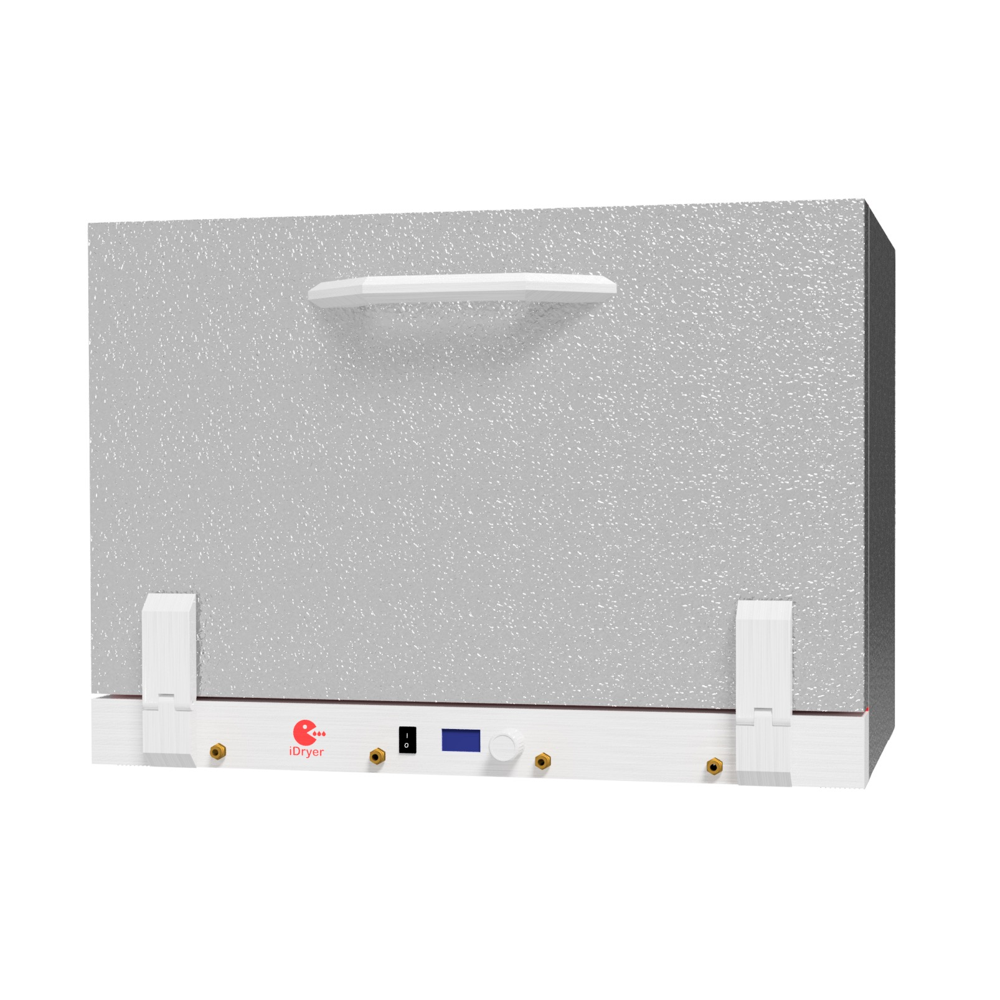
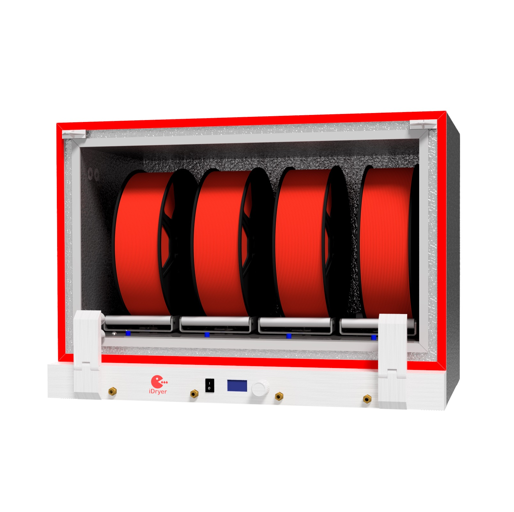
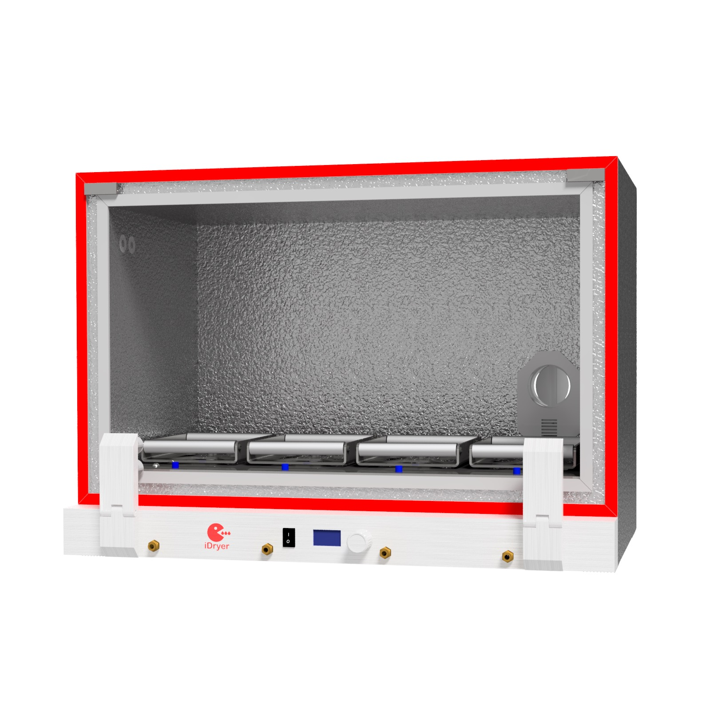

# iDryer x4 Filament-Trockner

## Funktionen
- Anzahl der Spulen: 4
- Trocknungstemperatur: bis 110 °C
- Heizertemperaturkontrolle: ja
- Kammerlufttemperaturkontrolle: ja
- Trocknungszeit: unbegrenzt
- Erzwungene Belüftung: ja
- Filament-Waage: ja
- Voreinstellungen: ja
- Filamenttypen: PLA, ABS, HIPS, PETG, SBS, Flex, PA6, PA12, PC, ABS, ASA, PP, POM und weitere

!!! info "Vollständiges Gehäusemodell"

    [PIR x4 Gehäuse](../../../CAD/v2/PIRx4.stp)

    Material der gedruckten Teile - ABS oder ABS CF

!!! note "Zuschnitt"

    [Zuschnitt x4](../../../PDF/v2/cut_plan_x4.pdf)

    [Zuschnitt x4 auf einem Blatt](../../../PDF/v2/cut_plan_x4_single_sheet.pdf)

!!! warning "Wichtig"

    Alle im Gehäuse befindlichen Teile werden aus Materialien gedruckt, die Erwärmung ab 100 °C und höher vertragen.

    Die Wärmeisolierung des Luftkanals im x4-Projekt dient zu Informationszwecken und kann in dieser Form verwendet oder mit einem beliebigen Wärmeisolationsmaterial beklebt werden. Falls dies nicht erfolgt, wird die Aufwärmgeschwindigkeit verringert und der Stromverbrauch erheblich erhöht!
