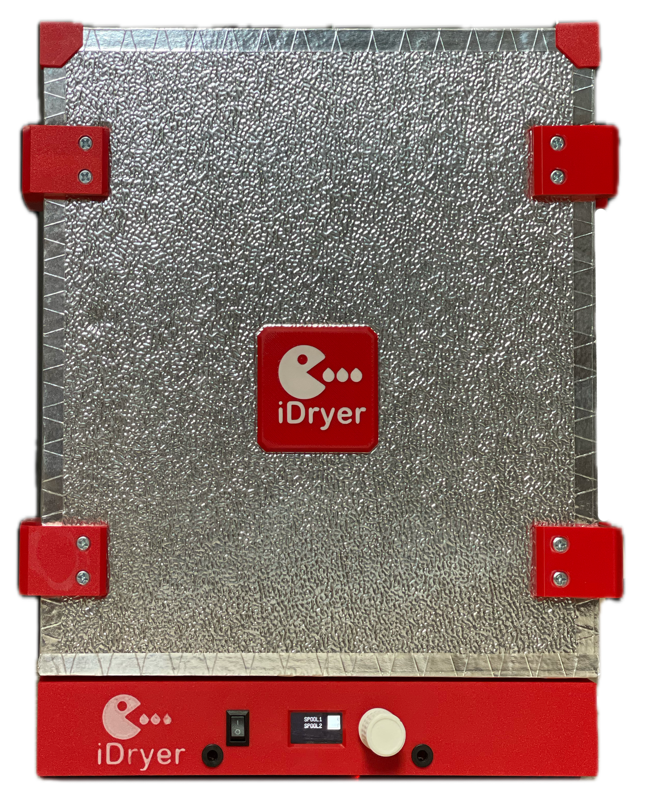

# iDryer V3

!!! note 

    Angepasst für die Arbeit mit iDryerController und iDryerControllerV2

{.img-left}

## Aktuelle Version

### Besonderheiten

- Hoher Dokumentationsreifegrad
- Dateien für eigenständiges Fräsen und Laserschneiden
- Hoher Reifegrad des KIT-Sets
- Teile werden auf industrielle Weise hergestellt
- Vollständige Ausstattung des Sets umfasst:
    - Gefräste Gehäuseteile aus PIR
    - Metallteile für Boden und Spulenbehälter
    - Leiterplatte
    - Elektronische Komponenten
    - Sensoren
    - Befestigungselemente
    - Aluminiumklebeband und Dichtung für die Türöffnung

### Vorteile
- Maximal angepasst für eigenständigen Zusammenbau
- Offener [Quellcode](https://github.com/pavluchenkor/iDryerController) der Firmware
- Offenes [Elektronikprojekt](https://oshwlab.com/svet_team/idryer_copy_copy)

[Erhältlich als Bausatz zum Selbstbau](https://store.idryer.org/)

   
