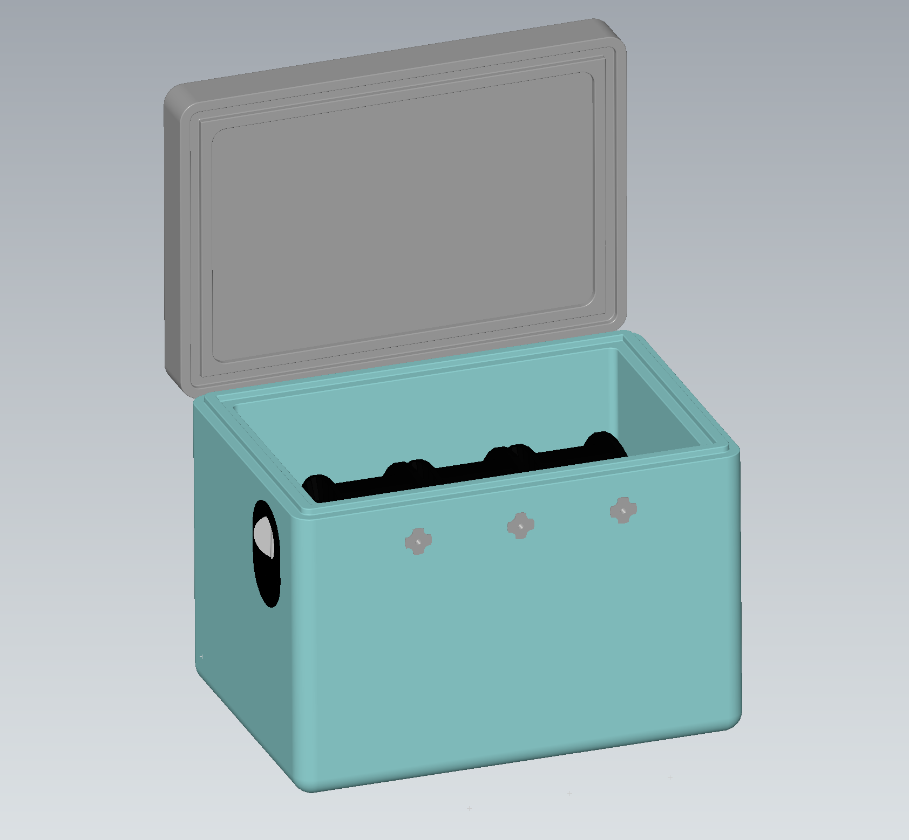

# EPP Enclosure

Dryer housing made of EPP (Expanded Polypropylene)

Polypropylene has low moisture absorption and features excellent electrical insulation properties over a wide temperature range.
Maximum operating temperature is 120 °C.
A wide variety of ready-made boxes of different sizes is available on the market.

{.img-left-50}

Discussion threads:

[Group \:fontawesome-solid-paper-plane:](https://t.me/iDryer){ .md-button }

[Discussion 2 \:fontawesome-solid-paper-plane:](https://t.me/iDryer/2175)

[Discussion 3 \:fontawesome-solid-paper-plane:](https://t.me/iDryer/2304)

[Discussion 4 \:fontawesome-solid-paper-plane:](https://t.me/iDryer/1244)

[Discussion 5 \:fontawesome-solid-paper-plane:](https://t.me/iDryer/1244)

<!--     -->
