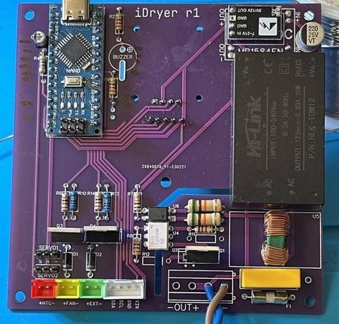
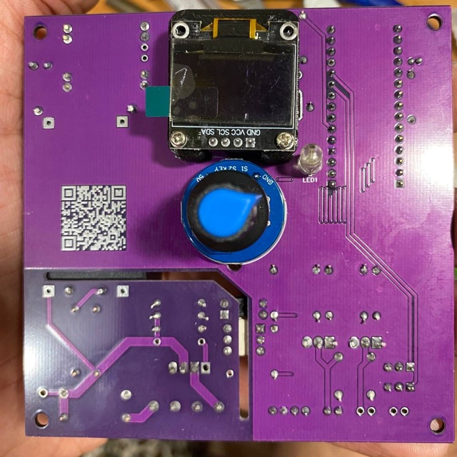

# Printed Circuit Board

## r2

***Deprecated version without scale, filament end sensor, but with support for 24V heater***

!!! warning annotate "Download files for r2"

    PCB Design r2 
    [oshwlab](https://oshwlab.com/svet_team/idryer) 
    [easyeda](https://easyeda.com/editor#project_id=2e5c7e9f855c4382b6348d0dd1a322dc)

    BOM for self-assembly r2 [google docs](https://docs.google.com/spreadsheets/d/13WdUZXiJUIk1PS-rFiE8_W3LRcMZVskWiTUnrRRYlAE/edit?usp=sharing)

You can view photos in our Telegram group in this post:
[photo of assembly by group member](https://t.me/iDryer/3103)

   
