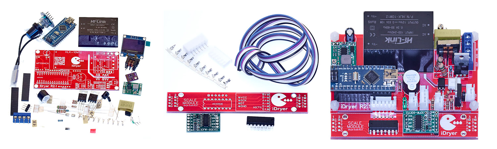

# KIT

{.img-left}

The iDryer v3 KIT includes all the necessary components for self-assembly of the iDryer controller: the PCB, display, rotary encoder, sensors, machined PIR panels for L-groove and tongue-and-groove assembly, and metal parts for the floor and spool holders.

All electronic components are through-hole and large, suitable for both beginners and experienced hobbyists.

Available both pre-assembled and as a DIY kit.

[Box contents (electronics) video](https://youtube.com/shorts/1hu8ouUc0jI?si=bNsCUIabV3f5F1-T)

[iDryer Assembly Guide](https://www.youtube.com/watch?v=QL7AUkCoISA&list=PLv8eJa-BRh3z09ve9bOKYYc3aWBMgUUt0&index=1) <br> <br>


!!! note annotate "Full KIT Contents"

```
- PCB
- ARDUINO_NANO
- OLED-128X64-I2C
- Rotary Encoder EC11
- SG-90 180° Servo Motor
- DC-DC Step Down MP1584
- HX711
- BME-280
- Thermostat NC 130°C
- BLS-4 2.54mm 30cm
- BLS-5 2.54mm 30cm
- XH-4P-2.54 30cm
- Thermistor
- HLK-10M12
- PTC Ceramic Heater (or included in PIR module)
- Fan 7530
- CD74HC4052E
- MOC3023
- 814
- Active Buzzer 5V
- Power Switch
- 2A 250V
- BT137-600E
- N-Channel FET IRF840
- Filter 10MH
- 0.1uF 280V
- 220uF 16-25V
- 10uF 5-16V
- 1N4007
- 51K 2W
- 10K
- 4.7K
- 1K
- 220Ω
- XH-4P-2.54
- XH-2P-2.54
- KF128L-5.08-4P
- DB301V-3.5-2P
- PLS-5 (encoder)
- PLS-4 (OLED)
- PLS-3 (servo)
- 100K 5% 3950
- Rotary Encoder EC11
- GY-BME280-5V
- Delta 7530 BFB0712H
- 220V/100W Heater
- KSD9700 130°C
- XH2.54 4P
- Dupont 4P 30cm wire connector
- Dupont 5P 30cm wire connector
- SG90 180° Servo
- KF128 5.08/4P
- Enclosure Panels
- Metal Floor
- Metal Spool Holder Arm
- Aluminum Tube 10x1mm 86mm
- Bearing 623
- Load Cell
- Fitting
- Power Cable with Plug
```

[Order KIT](https://store.idryer.org/)

<!-- [](https://t.me/iDryer)  [](https://www.youtube.com/@iDryerProject) [](https://rutube.ru/channel/34401569/) -->
