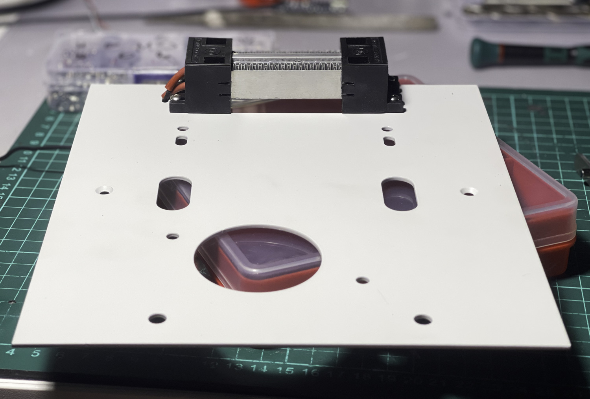
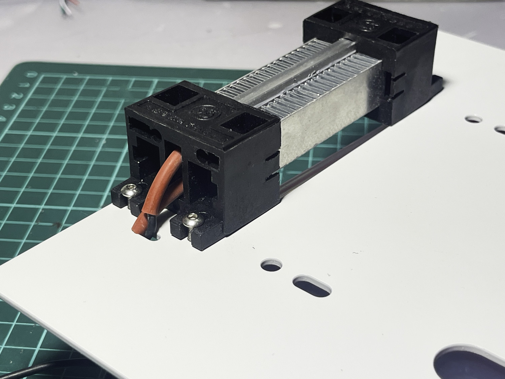
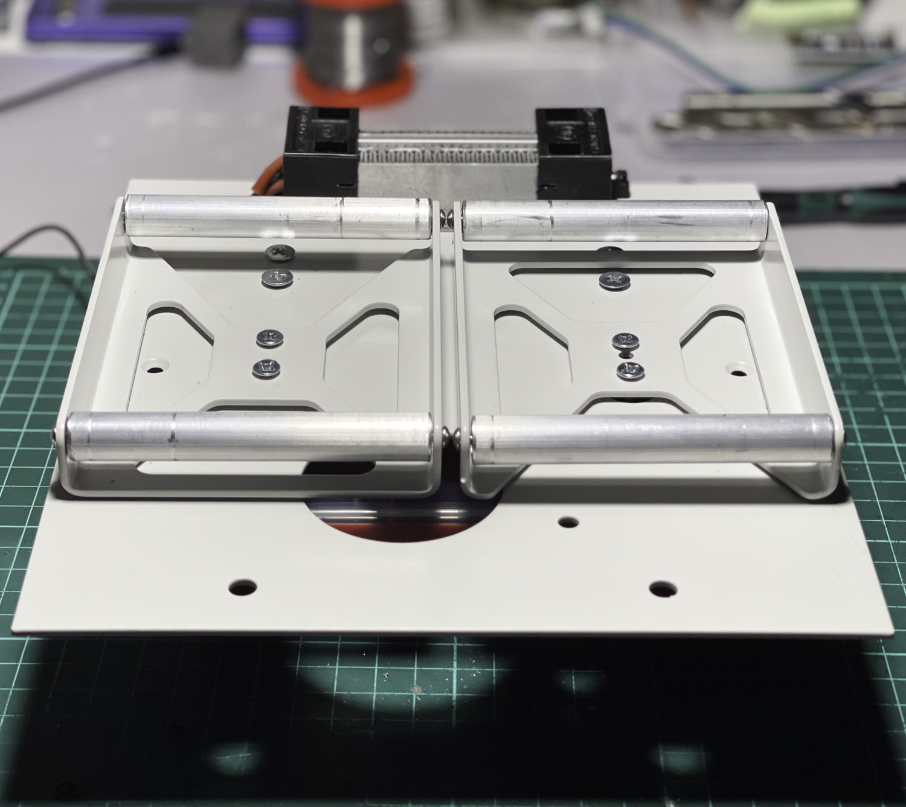
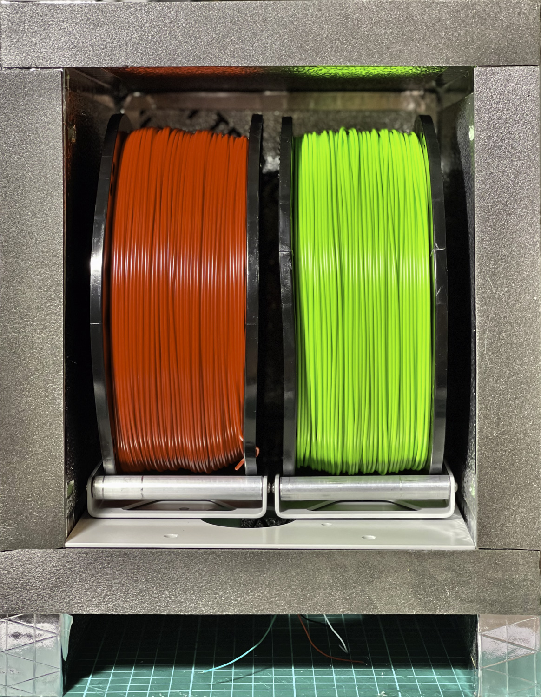
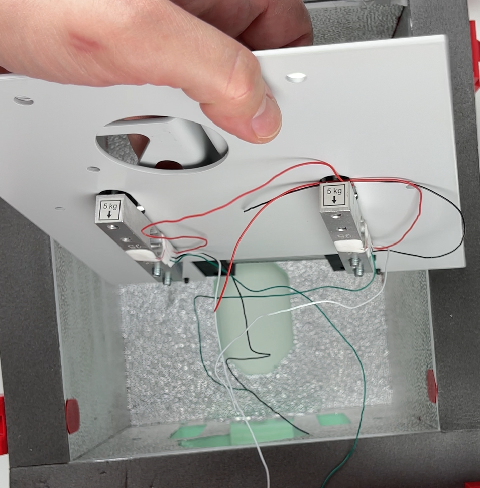
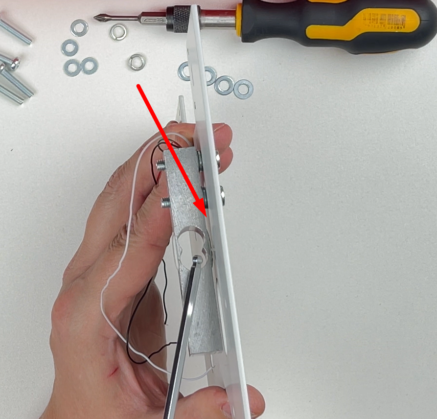
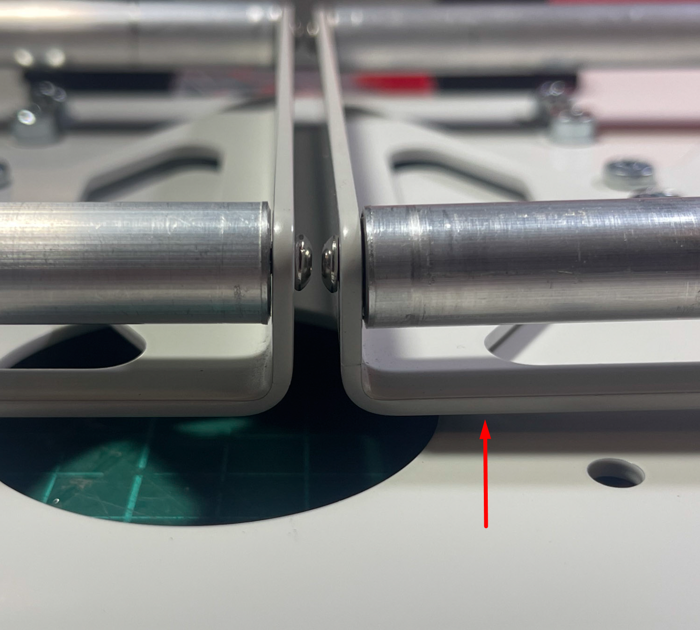

# Floor and Spool Holders

Metal parts for the floor and spool holders.

- 
- 
- 
- 

## Load Cell Installation

5 kg load cells are used. The load cells should be installed with the arrow pointing downward.

It is necessary to set a gap using washers between the floor and the load cell so that the compound covering the strain gauge does not touch the floor surface.

Depending on the sensor manufacturer, either M5 or M4 screws (20 mm in length) may be used to mount the load cell to the floor. The spool holder is typically attached with 4 mm screws, 16-20 mm long.

The gap between the spool holder and the floor should be 2-4 mm and is set using printed spacers or washers. The gap must allow free vertical movement of the spool holder under the filament's weight.

## Wiring

Wires are routed into the lower compartment through notches in the load cell grooves. These notches are sealed from below using aluminum tape.
