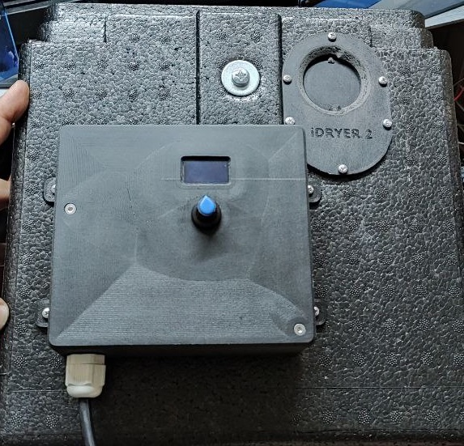
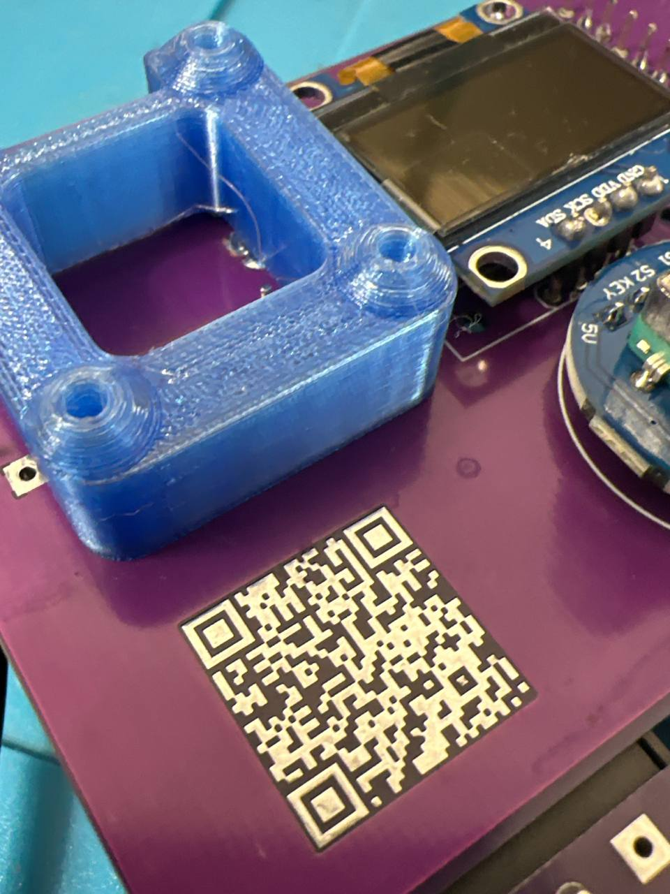

# Корпус контроллера r2

скачайте и распечатайте два файла [разработано @gungrel](https://t.me/gungrel)

## Файлы

!!! quote "Файлы для печати"

    **[iDryer v1 prototype](../../../CAD/common/pcb-case/Assembly_ebox.stp)** - Корпус

    ** [iDryer v2](../../../CAD/common/pcb-case/screen_stand.stp)** - пороставка экрана
