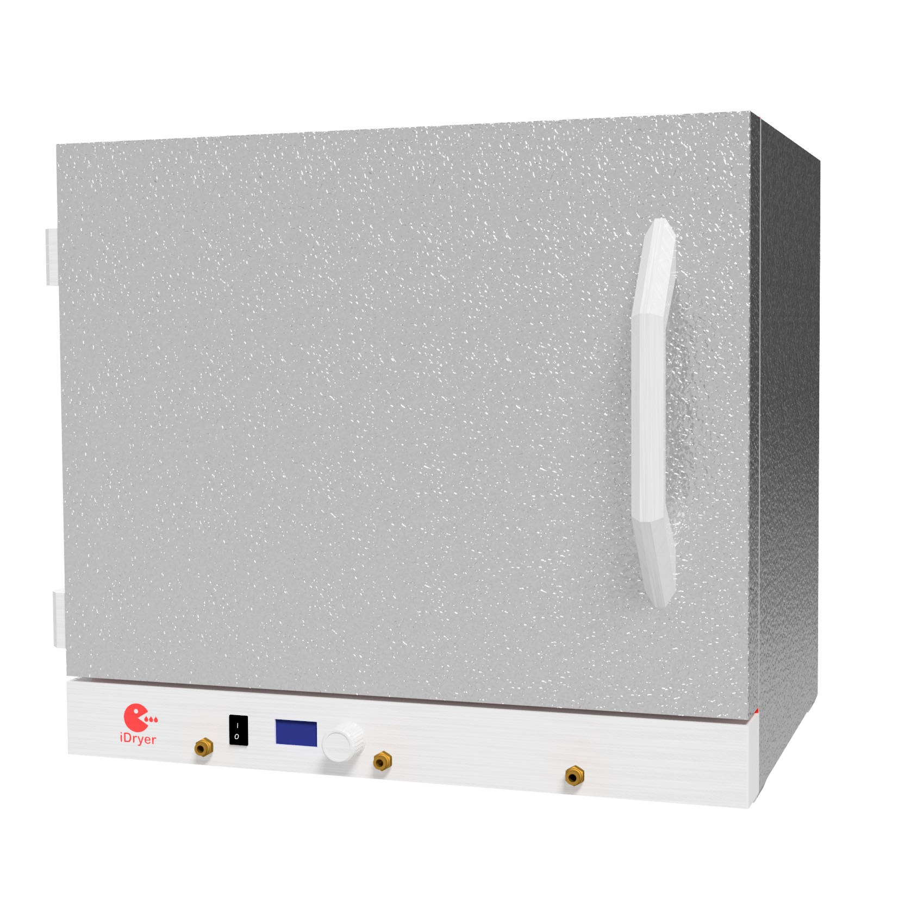
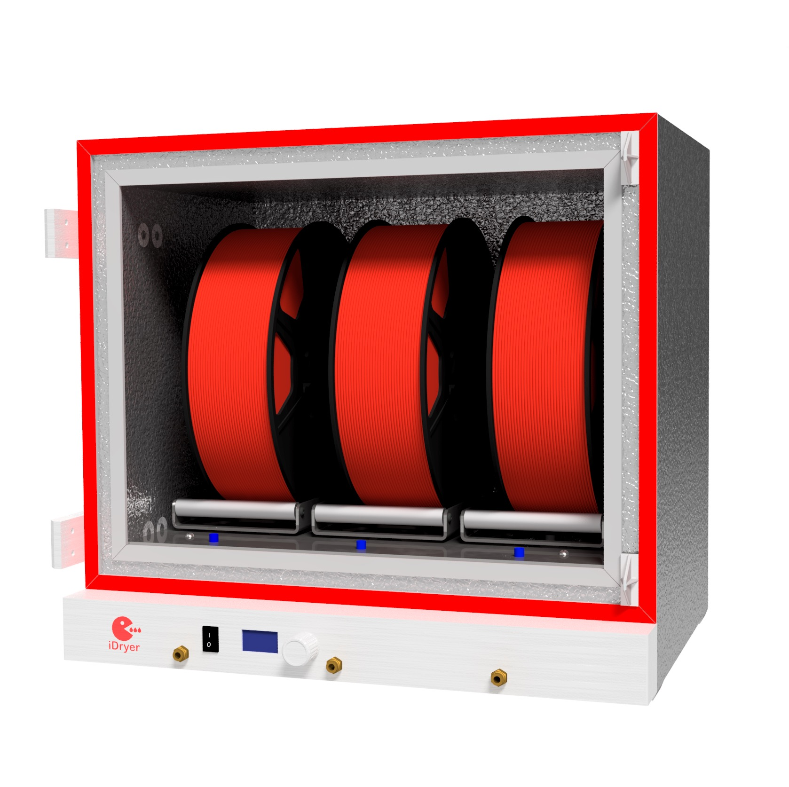
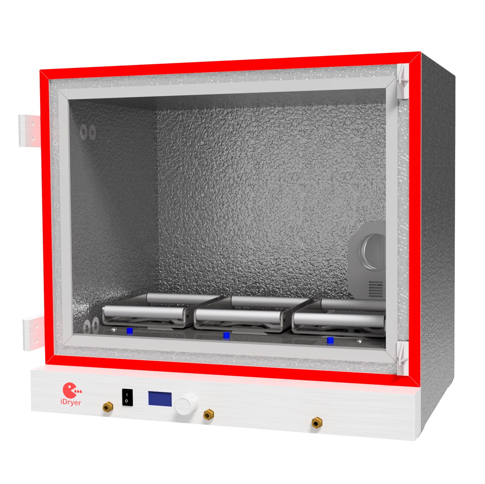

# Сушилка филамента iDryer x3

## Особенности

- Количество катушек: 3
- Температура сушки: до 110С
- Контроль температуры нагревателя: да
- Контроль температуры воздуха в камере: да
- Время сушки: не ограничено
- Принудительное проветривание: да
- Взвешивание филамента: да
- Пресеты: да
- Типы филамента: PLA, ABS, HIPS, PETG, SBS, Flex, PA6, PA12, PC, ABS, ASA, PP, POM и другие

!!! info "Полная модель корпуса"

    [Корпус PIR x3](../../../CAD/v2/PIRx3.stp)

    Материал печатных деталей - ABS или ABS CF

!!! note "Раскрой"

    [раскрой](../../../PDF/v2/cut_plan_x3.pdf)

!!! warning "Важно"

    Все детали находящиеся внутри  корпуса печатаются из материалов выдерживающих нагревание 100С и выше.

    Воздуховод в подвале сушилки необходимо изолировать, теплоизоляция воздуховода в проекте x3 представлена для ознакомления, можно использовать в таком же виде или оклеить воздуховод любым теплоизоляционным материалом. Если этого не сделать, скорость прогрева будет снижена, а потребление электричества увеличится значительно!
