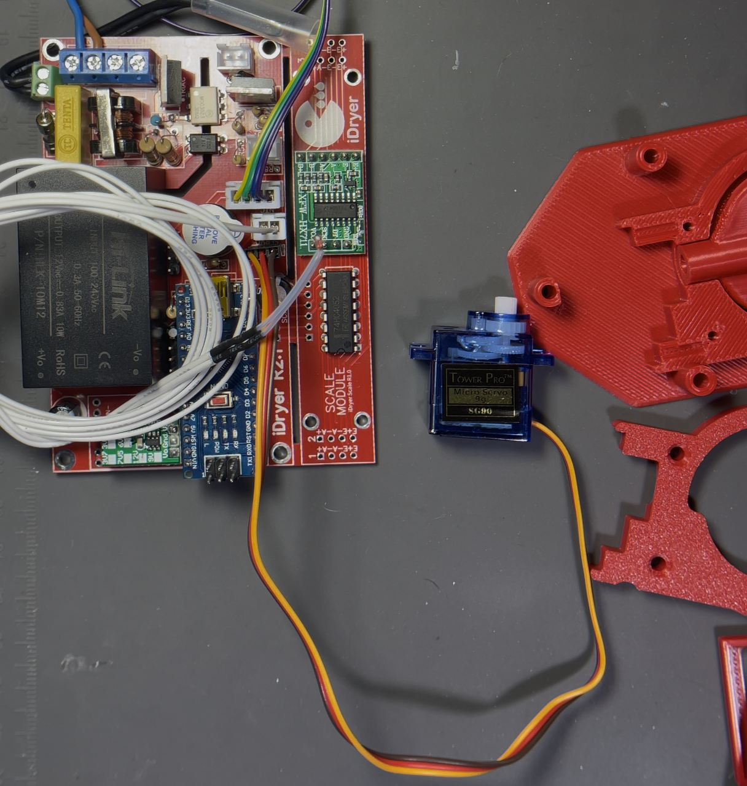
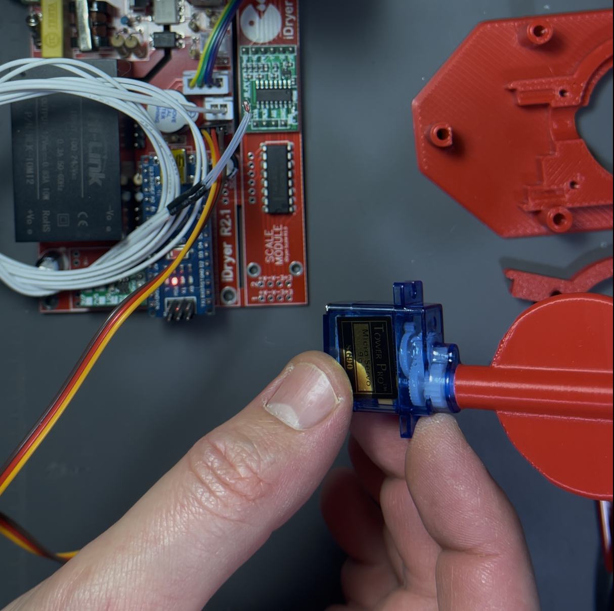
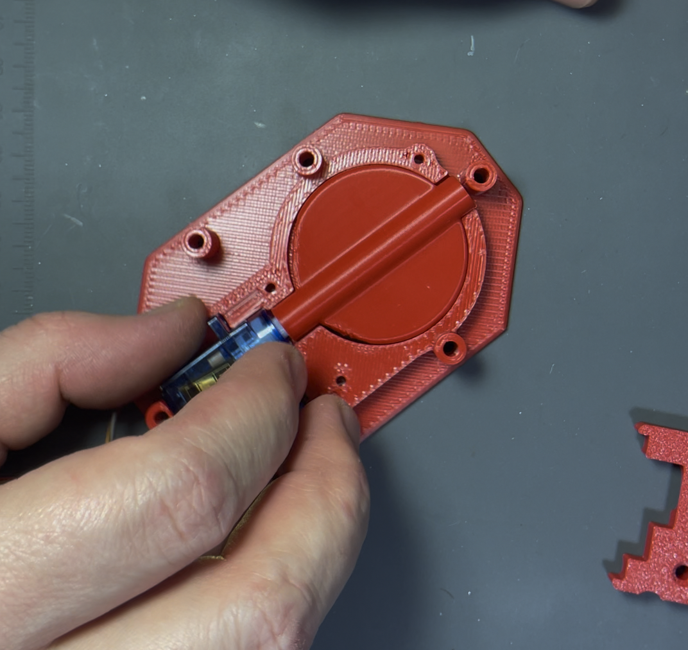
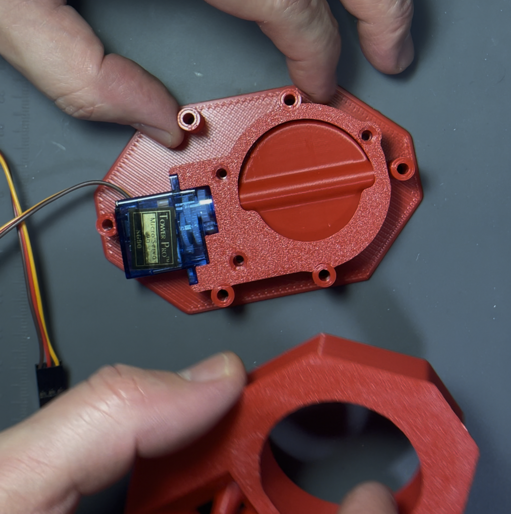
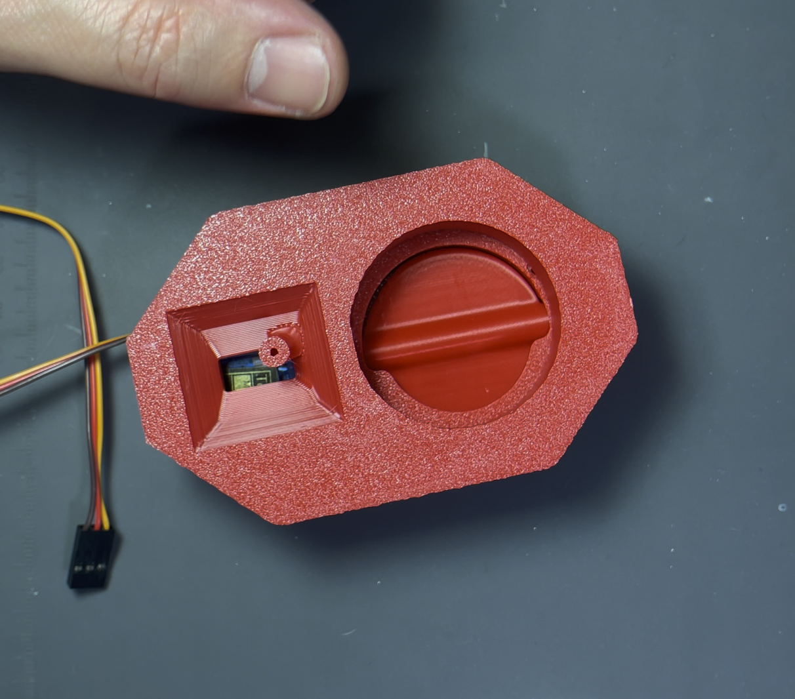
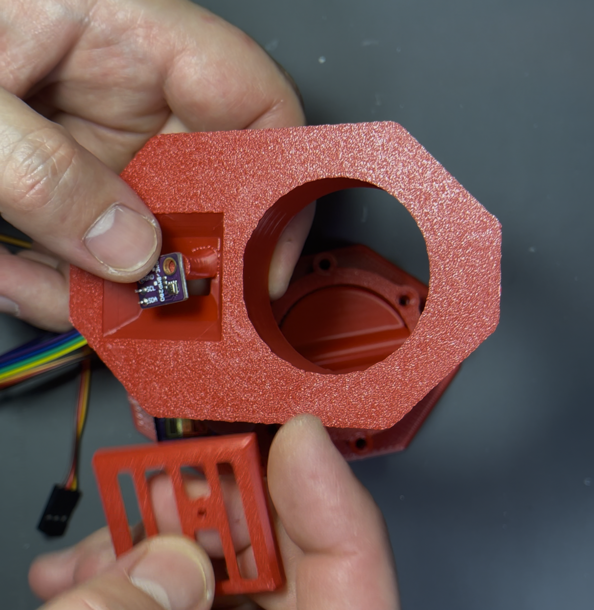
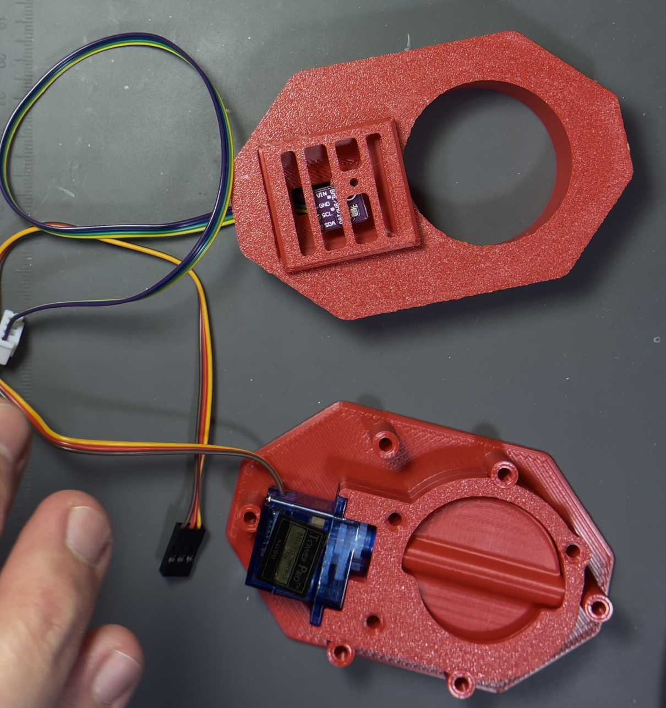
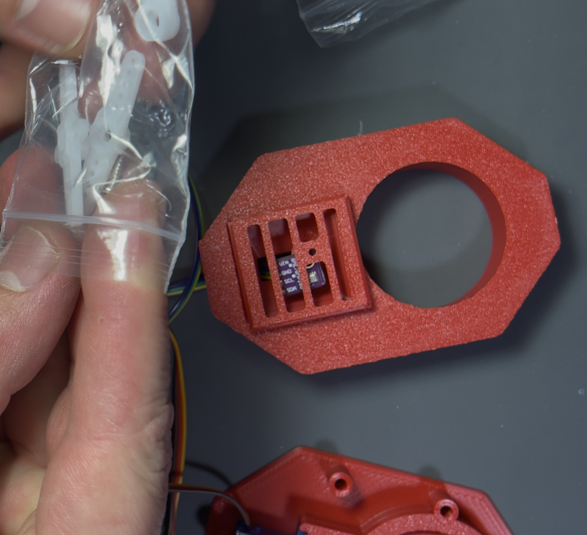
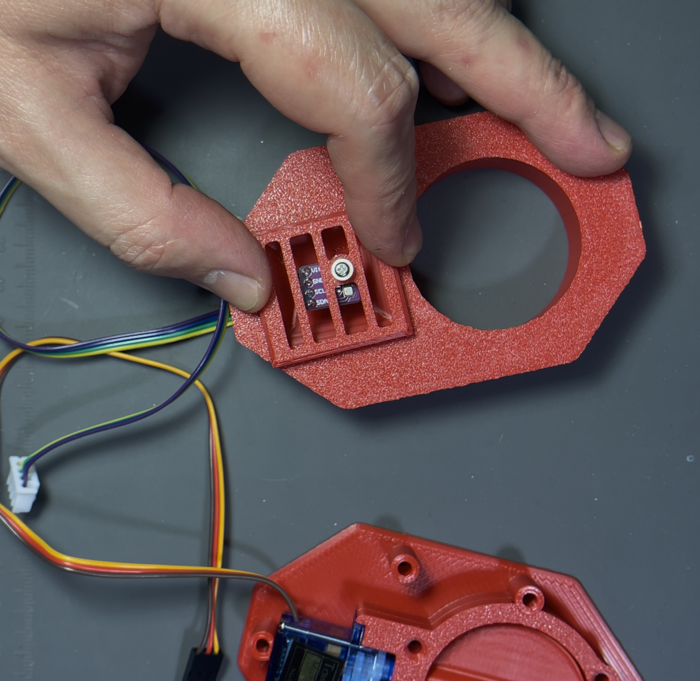
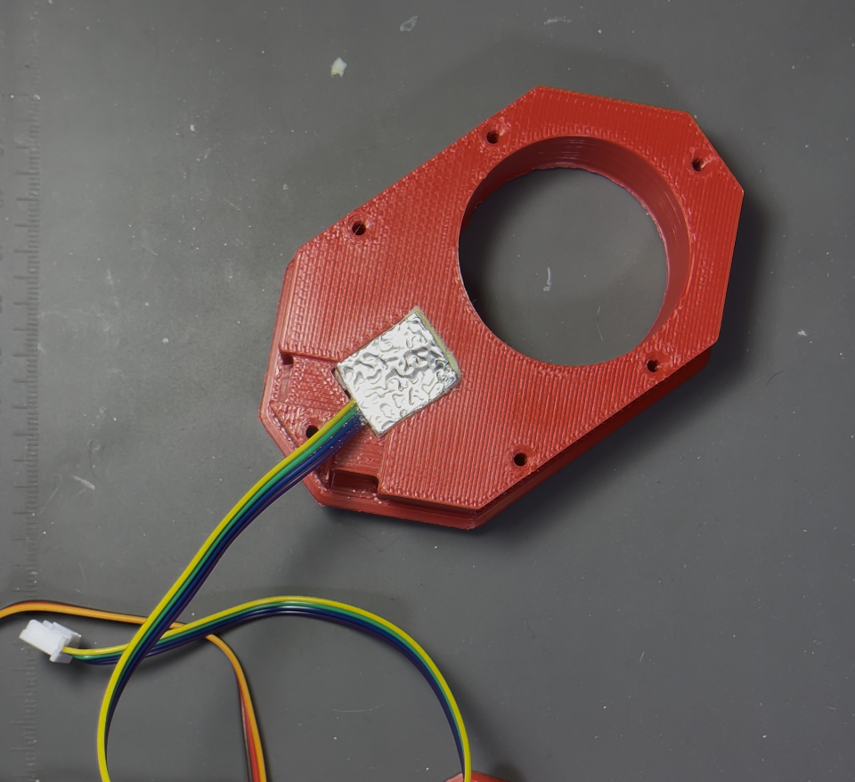

# Сборка и проверка заслонки вентиляции

## Подгонка
Перед установкой сервопривода в корпус заслонки необходимо собрать корпус без него и проверить плавность хода заслонки. Заслонка должна перемещаться свободно, без заеданий в любом положении. При необходимости следует произвести незначительную механическую доработку деталей заслонки (например, удалить заусенцы, подогнать посадочные места или притереть ось).

## Установка на вал
После проверки плавности хода можно надеть заслонку на вал сервопривода. Фиксировать саморезом необязательно, а в ряде ситуаций и вредно.

## Проверка до сборки
Проверка работы перед установкой в корпус
Рекомендуется подключить сервопривод к управляющей плате и выполнить проверку работы узла на столе. Убедитесь, что шторка свободно перемещается при подаче управляющих сигналов. При возникновении подклиниваний устраните их до перехода к дальнейшей сборке.

Установка исходного положения заслонки производится при подключенном сервоприводе, в меню необходимо выбрать тест и подобрать положение заслонки на валу таким образом, чтобы в закрытом положении заслонка располагалась параллельно длинной стороне сервопривода.

## Сборка

Установите сборку заслонки и сервопривода в базовую деталь.
Зафиксируйте её при помощи фиксирующего кольца. При этом прикручивать сервопривод и кольцо к базовой детали не требуется, так как при финальной сборке корпус будет стянут винтами, обеспечивая необходимую фиксацию всех компонентов.

Установите датчик температуры влажности, при наличии теплоизоляционного материала, вырежьте подходящий по размеру прямоугольник и вставьте его как показано на фото.

## Проверка

После сборки основного узла следует обратить внимание на поведение устройства при включении двигателя: если заслонка заедает, возможно значительная просадка питающего напряжения, что может привести к перезагрузке микроконтроллера. Если во время работы устройство неожиданно перезагружается, следует проверить заслонку на наличие механических подклиниваний.

Рекомендуется проверить работу узла заслонки до его окончательной установки в корпус. Для этого может потребоваться предварительная сборка управляющей платы и прошивка микроконтроллера. Также допускается использование отдельного устройства для тестирования сервоприводов. При отсутствии готовой платы допускается установка узла в корпус с последующей проверкой после сборки электроники.
