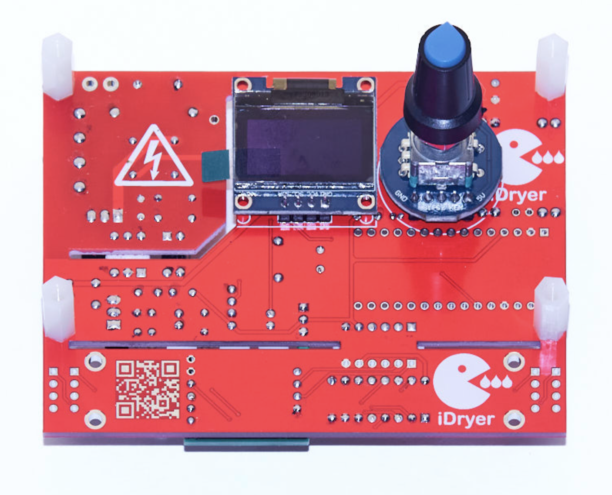
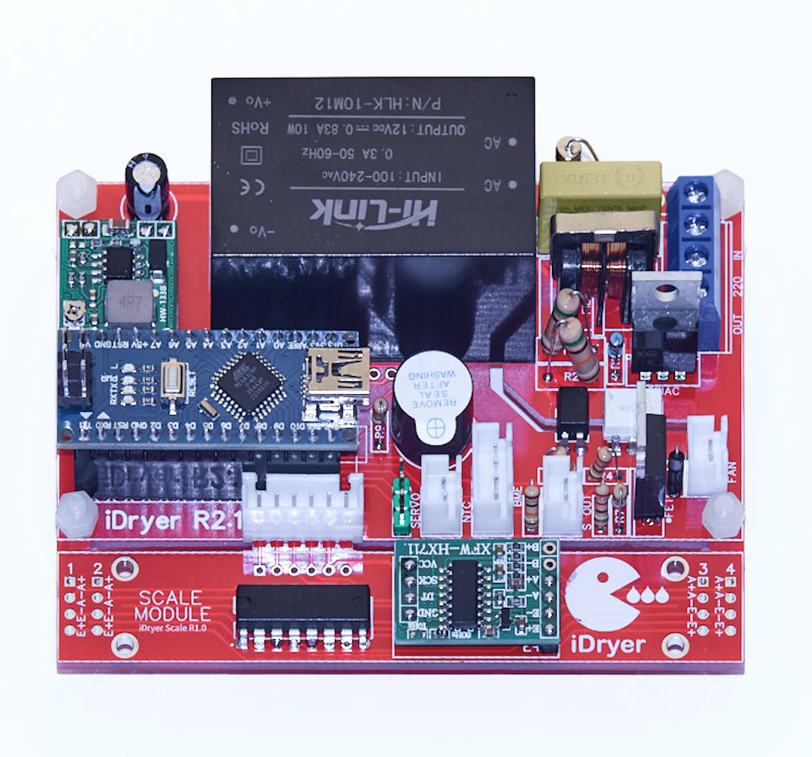

# Печатная плата

## iDryer r2.1

Вы можете самостоятельно заказать изготовление печатной платы и приобрести необходимые компоненты.
Если Вы имеете минимальный опыт пайки, то сборка не составит труда, все компоненты выводные и имеют крупный размер, а участники группы всегда помогут советом.

!!! note "Файлы для скачивания r2.1"

    PCB Design r2.1 [jlcpcb.com](https://oshwlab.com/svet_team/idryer_copy_copy)

    BOM для самостоятельной сборки r2.1 [google docs](https://docs.google.com/spreadsheets/d/1Y0MG9n_SadcK8cb_-e9J9ABQYqM_iH7iXZHlKbaz7wk/edit?usp=sharing)

## Внешний вид

!!! warning "Экран и энкодер"
    В текущей версии корпуса экран и энкодер подключаются проводами идущими в наборе для самостоятельной сборки
